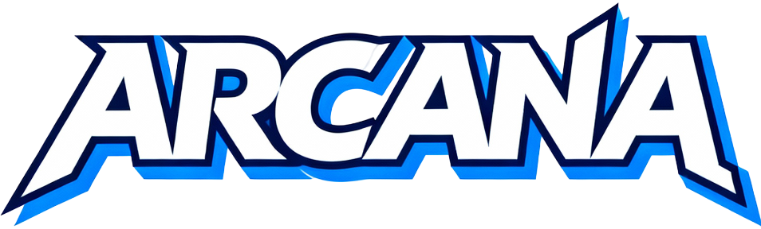

  
  
  <h3><i>"I am thou, thou art I..."</i></h3>

  

    A C++ Deep Learning Framework inspired by the Journey of the Fool.
  

  <!-- Main Action Buttons (Thematic) -->
  

    
    
  

  <!-- Tech Stack (Informative) -->
  

    
    
    
    
  

---