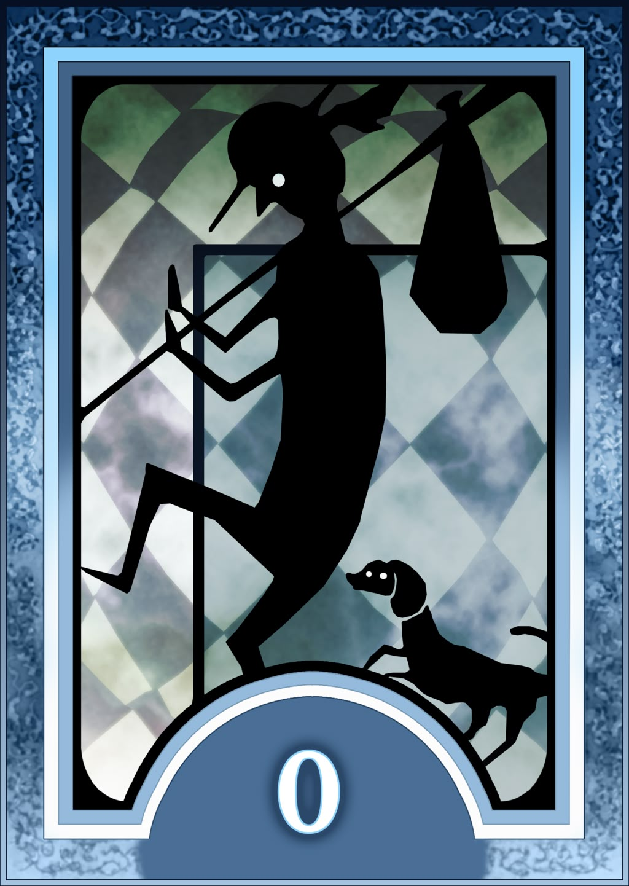

<div align="center">
  <h1>Arcana: The Fool (0) — Tensor</h1>
  
  <br>
  <em>"The moment man devoured the fruit of knowledge, he sealed his fate... <br>
  Entrusting his future to the cards, man clings to a dim hope."</em>
</div>

---

## 🌑 Introduction

**The Fool (0)** represents the beginning of a journey. Infinite possibilities. A void that craves to be filled.

In the world of **Arcana**, the `Tensor` is the manifestation of this potential. It is the raw, unshaped clay from which all intelligence emerges. It holds no bias, no purpose—only data. Whether it becomes a tool for creation or destruction depends entirely on the one who wields it.

> **Rank 1:** Unlocked automatically upon initialization.

## 🗝️ The Contract (API)

To wield the power of the **Tensor**, one must understand its fundamental laws.

### 🔹 Creation (The Beginning)
Like the Fool stepping off the cliff, a Tensor can be born from nothingness or chaos.
```c++
// Initialize a Tensor filled with zeros (The Void)
auto t_void = Tensor<float>::zeros({3, 3});

// Summon chaos (Random Normal Distribution)
auto t_chaos = Tensor<float>::randn({3, 3});

// A blank slate (Uninitialized memory)
auto t_blank = Tensor<float>::empty({5, 10});
```

### ⚔️ Operations (The Struggle)
Conflict is inevitable. Tensors clash, combine, and transform.

#### Tensor Arithmetic
Basic elemental fusion. Combine two Tensors to create a new entity.

##### Tensor x Tensor
```c++
auto t1 = Tensor<float>::ones({2, 2});
auto t2 = Tensor<float>::ones({2, 2});

// Fuse tensors to unleash greater power
auto add = t1 + t2;     // Union (Addition)
auto sub = t1 - t2;     // Separation (Subtraction)
auto mul = t1 * t2;     // Amplification (Element-wise Multiplication)
auto div = t1 / t2;     // Division
```

#### Scalar Operations
Imbue a Tensor with raw energy (scalar value). The energy flows through every cell.
```c++
auto t = Tensor<float>::ones({2, 2});
float val = 3.0f;

// Amplify the soul of the Tensor
auto s_add = t + val; // Add scalar to all elements
auto s_sub = t - val; // Subtract scalar
auto s_mul = t * val; // Scale up
auto s_div = t / val; // Scale down
```

#### Matrix Multiplication (The Art of Fusion)
The ultimate technique. Combine dimensions to forge a new reality

```c++
auto A = Tensor<float>::randn({128, 64});
auto B = Tensor<float>::randn({64, 256});

// The fusion of two souls... I mean, matrices.
auto C = A.matmul(B); // Result shape: {128, 256}
```

### 🎭 Shape-Shifting (The Mask)
A Tensor is fluid. It changes its form to suit the situation, yet its essence (data) remains unchanged.

```c++
auto t = Tensor<float>::ones({2, 3, 4});

// Change the perspective
auto view = t.view({6, 4});

// Transpose the dimensions
auto transposed = t.permute({0, 2, 1});
```

### 🧪 Alchemy (Transformation)
Matter cannot be created or destroyed, only changed. You may transform a Tensor's soul directly, or create a reflection of it.

#### Immutable Operations (The Reflection)
Create a new Tensor, leaving the original untouched. Safe, but costs memory.

```c++
auto t = Tensor<float>::randn({3, 3});

auto t_exp = t.exp();      // Exponentiation
auto t_log = t.log();      // logarithm
auto t_pow = t.pow(2);     // Power of 2
auto t_sqrt = t.sqrt();    // Square root
...
```

#### In-Place Operations (The Mutation)
Modify the Tensor directly. Efficient, but destructive. Look for the _ suffix — the mark of irreversible change.

```c++
auto t = Tensor<float>::randn({5, 5});
t.exp_();       // In-place exp
t.log_();       // In-place logarithm
t.pow_(3);      // In-place power of 3
t.sqrt_();      // In-place square root
...
```

### Activation functions
Standard activation functions in ML, such as: ReLU, Sigmoid, Tanh etc.

#### Immutable Operations (The Reflection)
```c++
auto t = Tensor<float>::randn({2, 5});

auto t_relu = t.relu();         // ReLU activation function
auto t_sigmoid = t.sigmoid();   // Sigmoid activation function
auto t_tanh = t.tanh();         // Tanh activation function
...
```

#### In-Place Versions
```c++
auto t = Tensor<float>::randn({5, 5});

t.relu_();         // In-place ReLU version
t.sigmoid_();      // In-place Sigmoid version
t.tanh_();         // In-place Tanh version
...
```

> *Note: Use in-place operations to save memory during training (The Grind).*

## ⚠️ Warning (The Dark Hour)

> *The Arcana is the means by which all is revealed...*

However, tread carefully.
*   **`[[nodiscard]]`**: Do not ignore the gifts of the Tensor. If you call `t.reshape(...)` and ignore the result, you have accomplished nothing but wasted cycles.
*   **Broadcasting**: Dimensions must align, or the contract will be broken (Runtime Error).

## 🔗 Social Link Status

| Status      | Description                                                    |
| :---------- | :------------------------------------------------------------- |
| **Reverse** | Not implemented. Matrix multiplication is slow (Naive O(N^3)). |
| **Upright** | **Current State.** Functional. Parallelized with OpenMP.       |
| **Broken**  | Memory leaks. (Hopefully fixed).                               |

---

## 🏟️ Training Hall (Tests)

To witness the true power of the Tensor in action, consult the ancient scrolls (unit tests). They contain the proven techniques and battle scenarios.

*   **Main Test Suite:** [`tests/tensor_test.cpp`](../../tests/tensor_test.cpp)
    *   *Creation & Initialization*
    *   *Arithmetic Operations*
    *   *Broadcasting Logic*
    *   *Reduction & Aggregation*
    *   *Operations with scalar*

> *"A Persona's power is meaningless without the skill to wield it."*

<div align="center">
  <h3><i>"I am thou, thou art I...<br>
  Thou hast acquired a new vow."</i></h3>
</div>